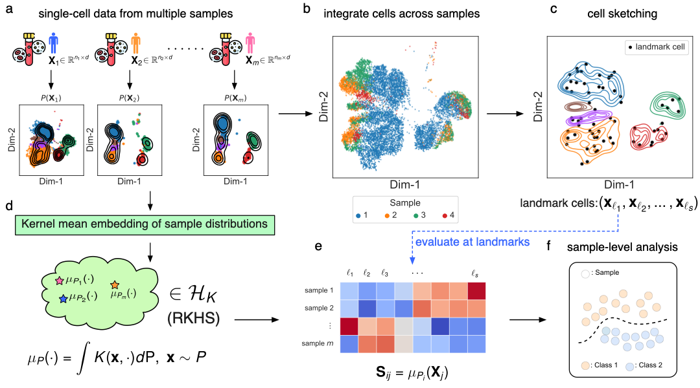

[](https://badge.fury.io/py/sclkme)
[](https://sclkme.readthedocs.io/en/latest/?badge=latest)
[](https://github.com/CompCy-lab/scLKME/actions/workflows/ci.yml)


# scLKME
A Landmark-based Approach for Generating Multi-cellular Sample Embeddings from Single-cell Data

## Introduction

scLKME is a computational approach designed for generating sample embeddings in multi-sample single-cell data. scLKME models samples as cell distributions, and leverages lanbmark-based kernel mean embedding to generate a sample-by-landmark kernel matrix as sample embeddings. The workflow of scLKME is as follows:

<p align="center">

</p>


## Installation

scLKME requires `python` version >= 3.8, < 3.11.

 `scLKME` including its dependencies can be installed via PyPI by running:

```shell
pip install sclkme
```

## Data

All the datasets used in this study are shared via `.h5ad` format. The datasets are available at:

- Multi-species: [here](https://drive.google.com/file/d/1dAWzdNHo7pyt7y-xr7M-pGkVsTGF8aEQ/view?usp=drive_link)
- Preterm: [here](https://drive.google.com/file/d/1vRKvU2kHQ464XnA9uRO-mRHH3UuNgGi3/view?usp=drive_link)
- Myocardial Infarction: [here](https://drive.google.com/file/d/1Hf6sXg40D4fgz9cb9P0kDXimM8YOdE3m/view?usp=drive_link)


## Get started

`scLKME`'s apis are designed to be compatible with the [scanpy](https://github.com/scverse/scanpy)'s ecosystem. To use `scLKME`, here is a basic example: 

```python
import sclkme
import scanpy as sc

n_sketch= 128
sample_id = "sample_id"

adata = sc.read_h5ad("path_to_h5ad_data")
sclkme.tl.sketch(adata, n_sketch=n_sketch)

X_anchor = adata[adata.obs['sketch']].X.copy()
sclkme.tl.kernel_mean_embedding(adata, partition_key="sample_id", X_anchor=X_anchor)

# sample_embedding
adata.uns['kme'][f'{sample_id}_kme']
```

For more details, examples and tutorials, check our [document](http://sclkme.readthedocs.io/).


### Run on a cloud platform

| Tutorials                                             | Colab                                                        |
| ----------------------------------------------------- | ------------------------------------------------------------ |
| Cell Sketching                                        | <a target="_blank" href="https://colab.research.google.com/github/CompCy-lab/scLKME/blob/main/docs/notebooks/tutorials/tutorial_cell_sketching.ipynb">  </a> |
| Landmark-based multi-sample single-cell data analysis | <a target="_blank" href="https://colab.research.google.com/github/CompCy-lab/scLKME/blob/main/notebooks/preterm_analysis/kme_analysis.ipynb">  </a> |                                                             |


## Citation

TBD
